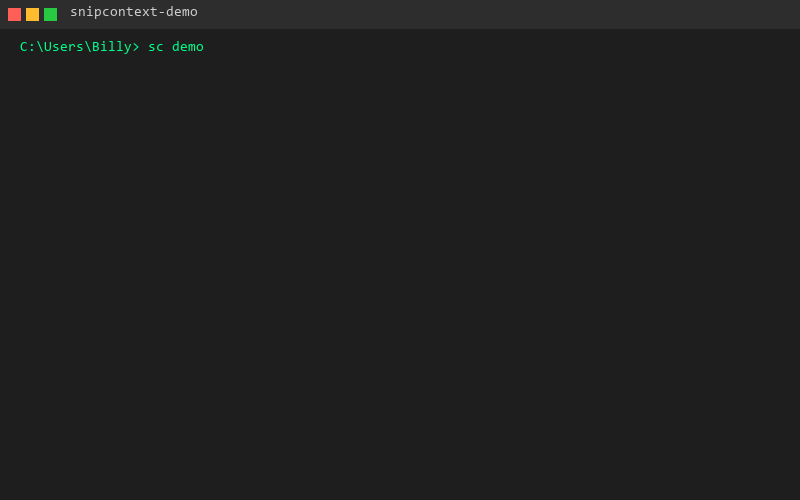

# SnipContext

**AI-powered code snippet & context manager.**

Save, search, tag, and instantly inject your best boilerplate, patterns, and context into any LLM (Claude, Cursor, Grok, Windsurf, etc.).

**Local-first • Open source • Built for humans + AI agents to collaborate.**

## Demo



```
$ sc demo
Seeded 8 demo snippets.

Listing snippets:
  - FastAPI dependency injection example (a2f387)
  - React useEffect data fetch hook (513ff6)
  - Python requests with retry (19ca4e)
  - SQLAlchemy async session factory (e54afe)
  - Go graceful shutdown HTTP server (29516b)
  - TypeScript zod schema for user input (ee8e89)
  - Rust error handling with anyhow (8351a1)
  - Bash retry wrapper for flaky commands (d5ac7d)

Sample search (semantic):
No search index available. Run sc build-index after adding snippets.

Sample export (generic):
┌─────────────────────────────────────────────────────────────────────────────┐
│                                Code Context                                 │
└─────────────────────────────────────────────────────────────────────────────┘
▌ 8 code snippets provided as context
  ... (full export formatted for LLM context)
```

## Why SnipContext?

- Stop rewriting the same auth flows, component patterns, or utility functions.
- Stop feeding LLMs messy or outdated code.
- Build your personal/team "second brain" of high-quality, reusable code.

## Key Features

- **Rich snippet saving** with tags, metadata, and versioning
- **Semantic search** (local embeddings via sentence-transformers + FAISS)
- **One-command export** optimized for major LLMs (generic, claude, cursor, openai)
- **CLI + Library support** (Python)
- **Plugin system** for new providers and exporters
- **Git-friendly, local-first storage** (JSON files + vector index)

## Quick Start

```bash
# Install from PyPI
pip install snipcontext

# Or install from source
git clone https://github.com/billybox1926-jpg/snipcontext
cd snipcontext
pip install -e ".[dev]"

# Run the interactive demo
sc demo

# List your snippets
sc list

# Search snippets (semantic search requires: sc build-index)
sc search "async python"

# Export for LLM context (copy-paste into Claude, Cursor, etc.)
sc export
```

## Commands

| Command | Description |
|---------|-------------|
| `sc add` | Add a new snippet |
| `sc get` | Retrieve a snippet by ID |
| `sc search` | Semantic search across snippets |
| `sc list` | List snippets with filters |
| `sc edit` | Edit a snippet in your editor |
| `sc delete` | Delete a snippet |
| `sc export` | Export snippets for LLM context |
| `sc build-index` | Build/rebuild semantic search index |
| `sc stats` | Show collection statistics |
| `sc demo` | Run interactive demo with sample snippets |
| `sc providers` | List available export providers |
| `sc config` | Manage configuration |

## Export Providers

| Provider | Format | Description |
|----------|--------|-------------|
| `generic` | Markdown | Universal format for any LLM |
| `claude` | Markdown | Optimized for Claude |
| `cursor` | Markdown | Optimized for Cursor |
| `openai` | JSON | OpenAI API compatible |

```bash
# Export with specific provider
sc export -p claude

# Export to file
sc export -o context.md -p generic
```

## Configuration

```bash
# Show current config
sc config show

# Initialize config file
sc config init

# Show data directories
sc config path
```

Data is stored locally in `~/.local/share/snipcontext/` (Linux/macOS) or `%LOCALAPPDATA%\snipcontext\` (Windows).

## Project Status

This repository is in **active development**. Core features implemented:
- ✅ Snippet CRUD (add, get, list, edit, delete)
- ✅ Tag-based organization
- ✅ Semantic search (local embeddings)
- ✅ Export to multiple LLM formats
- ✅ Plugin system for providers
- ✅ Configuration management
- ✅ Interactive demo (`sc demo`)

## Contributing

We **love contributions** from both humans and AI coding agents!

- Open issues for features/bugs
- Submit PRs (even small improvements to docs are welcome)
- Feel free to use Cursor, Claude, Grok, etc. to implement issues

See [CONTRIBUTING.md](CONTRIBUTING.md) for how to get involved.

---

**Star this repo if you're tired of copying the same code for the 100th time.**