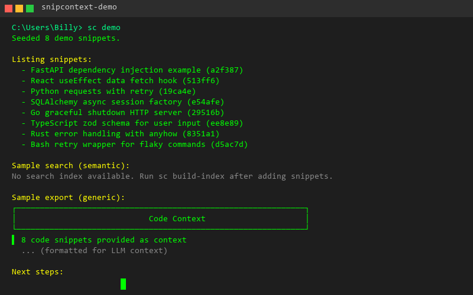

# SnipContext

[](LICENSE)
[](https://www.python.org/)
[](https://github.com/astral-sh/ruff)
[](https://mypy-lang.org/)
[](../../actions/workflows/ci.yml)
[](../../graphs/contributors)
[](../../commits/master)
[](../../issues)


**AI-powered code snippet & context manager.**

Save, search, tag, and instantly inject your best boilerplate, patterns, and context into any LLM (Claude, Cursor, Grok, Windsurf, etc.).

> **Local-first** — Open source — Built for humans + AI agents

🎧 **[Stop Feeding Your AI Clipboard Garbage](docs/Stop_Feeding_Your_AI_Clipboard_Garbage.m4a)** — Why SnipContext exists.



*Searching, tagging, and exporting code snippets — all from the terminal.*
*[Watch the animated demo (GIF)](docs/demo.gif)*

---

## Why SnipContext?

- **Stop rewriting** the same auth flows, component patterns, or utility functions
- **Stop feeding LLMs** messy or outdated code from your clipboard history
- **Build your personal/team "second brain"** of high-quality, reusable code
- **Semantic search** finds code by meaning, not just keywords
- **LLM-optimized exports** format your snippets for maximum comprehension

---

## Key Features

| Feature | Status | Description |
|---------|--------|-------------|
| Rich snippet saving with tags, metadata, and versioning | ✅ | Full CRUD with soft-delete and encryption |
| **Semantic search** with local embeddings | ✅ | sentence-transformers + FAISS, runs offline |
| **Hybrid search** — semantic + keyword fusion | ✅ | Configurable weights, TF-IDF + embeddings |
| LLM-optimized export providers | ✅ | Claude XML, Cursor, OpenAI, Generic Markdown |
| Auto-tagging via embeddings | ✅ | Suggests tags based on similar snippets |
| Similarity-based deduplication | ✅ | Warns when adding near-duplicate snippets |
| Encryption at rest | ✅ | Fernet (AES-128) with PBKDF2 key derivation |
| File watchdog / real-time indexing | ✅ | Auto-reindex on file changes |
| Plugin system | ✅ | Entry points for providers and exporters |
| CLI + Python library | ✅ | Use from terminal or import as a module |
| Git-friendly local-first storage | ✅ | One JSON file per snippet, easy to version |

### Supported LLM Providers

| Provider | Format | Best For |
|----------|--------|----------|
| **Generic** | Markdown | Universal compatibility |
| **Claude** | XML documents | Anthropic Claude |
| **Cursor** | File-style headers | Cursor IDE |
| **OpenAI** | Delineated sections | ChatGPT / GPT-4 |

---

## Quick Start

### Installation

```bash
# From PyPI with uv (recommended — faster installs, better dependency resolution)
uv tool install snipcontext

# From PyPI with pip
pip install snipcontext

# From source (after cloning)
cd snipcontext
uv sync                    # install all deps (including dev)
uv run sc --help           # run without activating venv

# Or with pip (traditional)
pip install -e ".[dev]"
```

> **💡 Why uv?** This project uses \`uv\` for dependency management (\`uv.lock\` pinned). \`uv sync\` guarantees reproducible installs. \`pip install\` works but may resolve dependencies differently.
# Or install directly from GitHub
pip install git+https://github.com/billybox1926-jpg/snipcontext.git
```

> **📦 Dependency Footprint:** SnipContext's core (add, list, edit, delete, keyword search, export) has no heavy dependencies. Optional features are split into extras:
> - `pip install snipcontext[semantic]` — semantic search with sentence-transformers + FAISS (~500MB, requires Rust toolchain on ARM)
> - `pip install snipcontext[encryption]` — encryption at rest with Fernet/AES-128 (requires Rust toolchain on ARM)
> - `pip install snipcontext[tui]` — interactive terminal UI
> - `pip install snipcontext[all]` — all optional features
>
> **Lighter embedding model:** The default model is `all-MiniLM-L6-v2` (~80MB). For a lighter alternative, set `SNIPCONTEXT_EMBED_MODEL_NAME=all-MiniLM-L4-v2` (~30MB) or `SNIPCONTEXT_EMBED_MODEL_NAME=paraphrase-MiniLM-L3-v2` (~20MB) before searching.
>
> **Skip semantic at runtime:** Even with `pip install snipcontext[semantic]`, use `--no-semantic` to force keyword-only search for faster results:
> ```bash
> snipcontext search "hello world" --no-semantic
> ```
>
> **ARM / Android / Termux:** The `semantic` and `encryption` extras require Rust to build native wheels. On platforms without pre-built wheels (ARM64, Android/Termux), install the core package only and use keyword search + export features. Semantic search and encryption gracefully degrade with clear error messages when their dependencies are missing.

> **Windows Users:** The short alias `sc` is shadowed by the Windows built-in `sc.exe` (Service Control). Three workarounds are available:
>
> 1. **Full command name** — always works after installation:
>    ```powershell
>    snipcontext add "print('hello')" --title "Hello" --tag python
>    ```
> 2. **Wrapper script** — shipped automatically with `pip install`; adds `snipcontext.cmd` to your Scripts directory:
>    ```powershell
>    snipcontext.cmd search "hello world"
>    ```
> 3. **Shell alias** — for quick access in the current session:
>    ```cmd
>    doskey snip=python -m snipcontext $*
>    ```
>
> ## Works with Hermes Agent
>
> SnipContext is built CLI-first, so [Hermes Agent](https://hermes-agent.nousresearch.com) can use it directly when running in terminal mode. Common integrations:
>
> - `export --provider generic/openai/cursor/claude` to pull snippets into a prompt
> - `edit --framework --version --source` to keep metadata current
> - `add --auto-title` for fast ingestion
>
> No Hermes-specific config is required
>
> ### Standalone Binary

Two options for running without a Python environment:

**Option 1 — `uv tool` (recommended, lightweight):**

```bash
# Core features only (keyword search, export)
uv tool install snipcontext

# All features (semantic search, encryption, TUI, web)
uv tool install "snipcontext[all]"

# Use directly — uv manages the venv invisibly
snipcontext add "print('hello')" --title "Hello"
```

**Option 2 — Pre-built binary (no Python needed):**

Download from the [latest GitHub Release](https://github.com/billybox1926-jpg/snipcontext/releases). Two variants are available for each platform:

| Variant | Includes | Size (approx.) |
|---------|----------|---------------|
| `snipcontext-<platform>` | Everything (semantic, encryption, TUI, web) | ~200MB |
| `snipcontext-<platform>-minimal` | Core only (keyword search, export) | ~80MB |

```bash
# Linux / macOS
chmod +x snipcontext
./snipcontext search "hello world"

# Windows
snipcontext.exe search "hello world"
```

**Build from source:**

```bash
# Using Make
make build-binary           # full build
make build-binary-minimal   # core-only build

# Using PyInstaller directly
pip install pyinstaller
pyinstaller snipcontext.spec
# Output: dist/snipcontext (or dist/snipcontext.exe)
```

### Security Considerations

- **Encryption at rest:** Uses Fernet (AES-128-CBC with HMAC) with PBKDF2 key derivation (100k iterations). Passphrase is read from `SNIPCONTEXT_ENCRYPTION_PASSPHRASE` env var — **never pass it on the command line** (shell history leak).
- **No default passphrase:** If encryption is enabled but `SNIPCONTEXT_ENCRYPTION_PASSPHRASE` is not set, the tool raises an error rather than falling back to a known default. This prevents a false sense of security.
- **stdin for sensitive content:** Use `sc add --file secret.py` or pipe via stdin (`cat secret.py | sc add --file`) to avoid shell history leaks with `--encrypt`.
- **Salt:** Auto-generated on first use and persisted to the config file. Back up your config file to avoid losing access to encrypted snippets.
- **No network calls:** All processing is local. No data leaves your machine.

```bash
# Windows: use the full command name or the .cmd wrapper
snipcontext add "print('hello')" --title "Hello" --tag python
snipcontext search "hello world"
snipcontext list
snipcontext stats

# Or run via module
python -m snipcontext add "print('hello')" --title "Hello" --tag python
```

### Verify Installation

```bash
snipcontext --help          # or: python -m snipcontext --help
snipcontext providers       # List available export providers
```

### Project-Local Snippets

> **v0.5.0+** — Commit your snippet collection to git and share it with your team.

By default SnipContext stores snippets in a global directory (`~/.local/share/snipcontext`). You can opt into **project-local** mode by scaffolding a `.snipcontext/` directory inside your repository:

```bash
sc init --local
```

This creates:

```text
.snipcontext/
├── config.yaml          # Project-specific settings
├── snippets/            # Snippet storage (JSONL)
├── index.faiss          # Search index (gitignored)
└── .gitignore           # Ignores index.faiss
```

Once initialized, every SnipContext command run from that directory (or any subdirectory) automatically uses the local collection. You can override the discovery order with environment variables:

| Priority | Source | Example |
|----------|--------|---------|
| 1 | `SNIPCONTEXT_HOME` env var | `SNIPCONTEXT_HOME=/path/to/snippets sc list` |
| 2 | `.snipcontext/` in CWD or ancestor | `sc init --local` in `/my/project` |
| 3 | Global platform directory | `~/.local/share/snipcontext` |

Use `sc info` to inspect the active mode and paths:

```bash
sc info
```

### CLI Usage

```bash
# Add a snippet
snipcontext add "def authenticate(token):\n    return jwt.decode(token, SECRET)" \
  --title "JWT Authentication" \
  --desc "Decode and verify JWT tokens" \
  --lang python \
  --tag auth --tag jwt --tag security

> SnipContext performs a fast hash-based exact duplicate check before the
> semantic dedup step. If a snippet with identical content already exists,
> you'll be prompted before adding it again.

# Add with rich metadata (v0.3.0+)
snipcontext add "from fastapi import FastAPI" \
  --title "FastAPI App Setup" \
  --framework fastapi \
  --version "0.100+" \
  --source "https://fastapi.tiangolo.com/tutorial/first-steps/" \
  --custom "team=backend" --custom "priority=high"

# Search semantically
snipcontext search "how to validate auth tokens"

# Search by tag
snipcontext search "auth" --mode tag

# Export for Claude
snipcontext search "authentication" --provider claude --output context.xml

# List all snippets
snipcontext list

# Show stats
snipcontext stats

# Delete a snippet
snipcontext delete <snippet-id>

# Edit a snippet
snipcontext edit <snippet-id> --title "New Title" --add-tag python

# Edit metadata
snipcontext edit <snippet-id> --framework react --version "18.x" --source "https://react.dev"

# Rebuild search index
snipcontext build-index --force

# Benchmark vector latency
snipcontext benchmark index --vectors 5000 --index-type ivfpq

# Watch for file changes and auto-reindex
snipcontext watch

# Run the demo
snipcontext demo
```

### CLI Commands Reference

| Command | Description | Key Options |
|---------|-------------|-------------|
| `sc export` | Export snippets in LLM‑optimized format | `--provider/-p` (claude, cursor, openai, generic), `--output/-o`, `--query/-q`, `--id`, `--limit/-n` |
| `sc edit` | Edit an existing snippet | `<id>`, `--title`, `--content/-c`, `--tag/--add-tag`, `--remove-tag`, `--lang/-l`, `--source`, `--framework`, `--version`, `--interactive/-i`, `--force/-f` |
| `sc stats` | Show collection statistics | `--detailed/-d`, `--json` |
| `sc providers` | List available export providers | `--health` (run provider health checks) |
| `sc config path` | Show config / data / index directories | *(no options)* |
| `sc config show` | Show current configuration (YAML) | `--force` |
| `sc config set <key> <value>` | Update a config value | `--save/--no-save` |
| `sc history list` | Show recent search history | `--limit` |
| `sc history favorites` | Show favorite queries | *(no options)* |

#### `sc export`

Formats snippets for consumption by LLMs or IDEs.

```bash
# Export all snippets as Generic Markdown to stdout
snipcontext export --provider generic

# Export search results for Claude to a file
snipcontext export --query "auth" --provider claude --output context.xml

# Export specific snippets by ID
snipcontext export --id abc123 --id def456 --provider openai -o snippets.md

# Limit query results
snipcontext export --query "database" --limit 5 --provider cursor
```

**What gets exported:** snippet content, metadata (title, language, tags, framework, version), and an `Export schema version: 1.0.0` header.

#### `sc edit`

Supportspartial updates — only specified fields are changed.

```bash
# Update title and add a tag
snipcontext edit abc123 --title "JWT Auth" --tag security

# Update content from a file
snipcontext edit abc123 --file fixed_auth.py --lang python

# Update multiple metadata fields
snipcontext edit abc123 --framework fastapi --version "0.100+" --source "https://example.com"

# Open in $EDITOR for full editing
snipcontext edit abc123 --interactive
```

#### `sc stats`

```bash
# Basic overview
snipcontext stats

# Detailed analytics with distributions
snipcontext stats --detailed

# Machine-readable JSON
snipcontext stats --json
```

Shows: total snippets, tags, languages, encrypted count, size, dates, language distribution, top tags, access stats, and size metrics (detailed).

#### `sc providers`

```bash
# List all available export providers
snipcontext providers

# Check provider health
snipcontext providers --health
```

Built-in providers: `generic` (Markdown), `claude` (XML), `cursor` (file headers), `openai` (delineated sections).

#### `sc config path`

```bash
# Show all storage and config locations
snipcontext config path
```

Outputs: config file path, data directory, snippets directory, and index directory.

### Library Usage

```python
from snipcontext.core.models import Snippet, SnippetMetadata, Language
from snipcontext.core.storage import StorageEngine
from snipcontext.core.search import HybridSearch
from snipcontext.config.settings import get_config

# Initialize
config = get_config()
storage = StorageEngine(config)

# Create and save a snippet
snippet = Snippet(
    content="def memoize(fn):\n    cache = {}\n    ...",
    metadata=SnippetMetadata(
        title="Memoization Decorator",
        description="Cache function results",
        language=Language.PYTHON,
    ),
    tags=["python", "decorator", "performance"],
)
storage.save(snippet)

# Search with semantic understanding
searcher = HybridSearch(config)
searcher.index_snippets(storage.list_all())
results = searcher.search("cache function results decorator")

for r in results:
    print(f"{r.score:.3f} | {r.snippet.metadata.title}")
```

---

## 🔐 Encryption at Rest

SnipContext supports **Fernet (AES-128)** encryption for sensitive snippets. When enabled, snippet content is encrypted at rest using a key derived from a passphrase via PBKDF2 (100k iterations).

### Enable Encryption

```bash
# Enable encryption (required)
export SNIPCONTEXT_ENCRYPT_ENABLED=true

# Set passphrase (used for key derivation)
export SNIPCONTEXT_ENCRYPTION_PASSPHRASE="your-secure-passphrase"

# Optional: persist salt to config (auto-generated if omitted)
export SNIPCONTEXT_ENCRYPT_KEY_SALT="base64-encoded-salt"
```

### Encrypt Snippets

```bash
# Encrypt a new snippet
snipcontext add "api_key = 'sk-12345'" \
  --title "API Key" \
  --tag secret \
  --encrypt

# Mark as sensitive (auto-enables encryption)
snipcontext add "password = 'secret123'" \
  --title "DB Password" \
  --sensitive
```

### Decrypt for Viewing/Editing

```bash
# Decrypt for viewing
snipcontext decrypt <snippet-id>

# Encrypt an existing snippet
snipcontext encrypt <snippet-id>
```

> **Note:** When encrypted, the plaintext `content` is cleared from storage. The `encrypted_content` field stores the encrypted data. Use `snipcontext decrypt <id>` to restore plaintext for editing.

---

## 🔄 Index Rebuild & Resilience

SnipContext automatically detects and recovers from index corruption. The `HybridSearch` engine validates index integrity on load and rebuilds automatically when needed.

### Manual Rebuild

```bash
# Build or rebuild the semantic search index
snipcontext build-index

# Force rebuild (useful after corruption, dependency changes, or mode switches)
snipcontext build-index --force
```

### Auto-Recovery

The search engine automatically:

1. **Validates index integrity** on load (checks ID map lengths, matrix dimensions)
2. **Cleans up corrupted files** (deletes mismatched/corrupted index files)
3. **Falls back gracefully** — if semantic index unavailable, runs keyword-only search
4. **Rebuilds on demand** — `index_snippets()` auto-loads existing indices before rebuilding

### Watchdog / Real-time Indexing

Run `snipcontext watch` to monitor the snippets directory and automatically reindex when files change:

```bash
snipcontext watch
```

Disable via config if you prefer manual rebuilds only:

```bash
export SNIPCONTEXT_WATCHDOG_ENABLED=false
```

---

## Architecture

```
┌─────────────────────────────────────────────────┐
│                  CLI (Typer + Rich)              │
├──────────┬──────────┬──────────┬────────────────┤
│  add     │  search  │  export  │  edit/delete   │
│  list    │  stats   │  watch   │  demo          │
└────┬─────┴────┬─────┴────┬─────┴───────┬────────┘
     │          │          │             │
     ▼          ▼          ▼             ▼
┌─────────────────────────────────────────────────┐
│              Search Engine (HybridSearch)        │
│  ┌──────────────┐  ┌──────────────────────────┐ │
│  │   Semantic    │  │       Keyword            │ │
│  │  FAISS Index  │  │     TF-IDF (sklearn)     │ │
│  └──────────────┘  └──────────────────────────┘ │
├─────────────────────────────────────────────────┤
│              Storage Engine                      │
│         Git-friendly JSON per snippet            │
├─────────────────────────────────────────────────┤
│              Data Models (Pydantic v2)           │
│     Snippet / SnippetMetadata / Language         │
└─────────────────────────────────────────────────┘
```

See [`docs/ARCHITECTURE.md`](docs/ARCHITECTURE.md) for detailed design documentation.

---

## Roadmap

- [x] Core snippet CRUD with git-friendly storage
- [x] Semantic + hybrid search with local embeddings
- [x] LLM-optimized export providers (Claude, Cursor, OpenAI, Generic)
- [x] Rich CLI with Typer
- [x] Plugin system with entry points
- [x] Python library distribution (PyPI)
- [x] Auto-tagging and deduplication
- [x] Encryption at rest
- [x] File watchdog / real-time indexing
- [ ] Import from GitHub Gists
- [ ] Import from Git repositories
- [ ] Snippet templates and scaffolding
- [ ] Team sharing via git-sync
- [ ] VS Code extension

---

## Configuration

SnipContext uses environment variables and a YAML config file:

```bash
# Use GPU for embeddings
export SNIPCONTEXT_EMBED_DEVICE="cuda"

# Change embedding model
export SNIPCONTEXT_EMBED_MODEL_NAME="all-mpnet-base-v2"

# Adjust search weights
export SNIPCONTEXT_SEARCH_SEMANTIC_WEIGHT="0.8"

# Enable auto-tagging
export SNIPCONTEXT_AUTO_TAG_ENABLED=true

# Enable deduplication
export SNIPCONTEXT_DEDUP_ENABLED=true
export SNIPCONTEXT_DEDUP_THRESHOLD="0.95"
```

Or edit `~/.config/SnipContext/snipcontext.yaml`:

```yaml
embedding:
  model_name: "all-MiniLM-L6-v2"
  device: "cpu"

search:
  default_mode: "hybrid"
  semantic_weight: 0.7
  keyword_weight: 0.3
  top_k: 10

auto_tag:
  enabled: true
  threshold: 0.75

dedup:
  enabled: true
  threshold: 0.95
```

---

## Development

```bash
# Clone
git clone https://github.com/billybox1926-jpg/snipcontext.git
cd snipcontext

# Install dev dependencies
pip install -e ".[dev]"

# Run tests
pytest

# Run with coverage
pytest --cov=snipcontext

# Linting
ruff check .
mypy .

# Install pre-commit hooks
pre-commit install
```

## Documentation

- [`docs/search.md`](docs/search.md) — index types, auto-switch behavior, keyword fallback
- [`docs/benchmark.md`](docs/benchmark.md) — `sc benchmark index` usage
- [`docs/API.md`](docs/API.md) — Python library usage
- [`docs/providers.md`](docs/providers.md) — provider contract and custom provider guide
- [`docs/plugins.md`](docs/plugins.md) — plugin system, lifecycle hooks, and CLI commands

See [`docs/ARCHITECTURE.md`](docs/ARCHITECTURE.md) for detailed design documentation.

## Project Structure

```
snipcontext/
├── src/snipcontext/          # Python package
│   ├── __init__.py
│   ├── __main__.py           # python -m snipcontext
│   ├── cli/
│   │   └── main.py           # Typer CLI commands
│   ├── config/
│   │   └── settings.py       # Pydantic Settings
│   ├── core/
│   │   ├── models.py         # Pydantic data models
│   │   ├── storage.py        # Git-friendly JSON storage
│   │   ├── search.py         # Semantic + hybrid search
│   │   ├── auto_tag.py       # Embedding-based auto-tagging
│   │   └── watcher.py        # File watchdog
│   ├── plugins/
│   │   └── base.py           # Plugin base + manager
│   └── providers/
│       ├── base.py           # Provider interface
│       ├── claude.py         # Anthropic Claude XML
│       ├── cursor.py         # Cursor IDE format
│       ├── openai.py         # OpenAI format
│       └── generic.py        # Universal Markdown
├── tests/                    # Test suite
├── docs/                     # Documentation
│   ├── API.md
│   ├── providers.md
│   ├── plugins.md
│   └── ARCHITECTURE.md
├── pyproject.toml
├── CHANGELOG.md
└── README.md
```

---

## License & Contributing

MIT License — see [LICENSE](LICENSE) for details.

Contributions are welcome! Please read [CONTRIBUTING.md](CONTRIBUTING.md) and [CODE_OF_CONDUCT.md](CODE_OF_CONDUCT.md) first. New contributors should check out our [Good First Issues](../../issues?q=is%3Aissue+is%3Aopen+label%3A%22good+first+issue%22).
